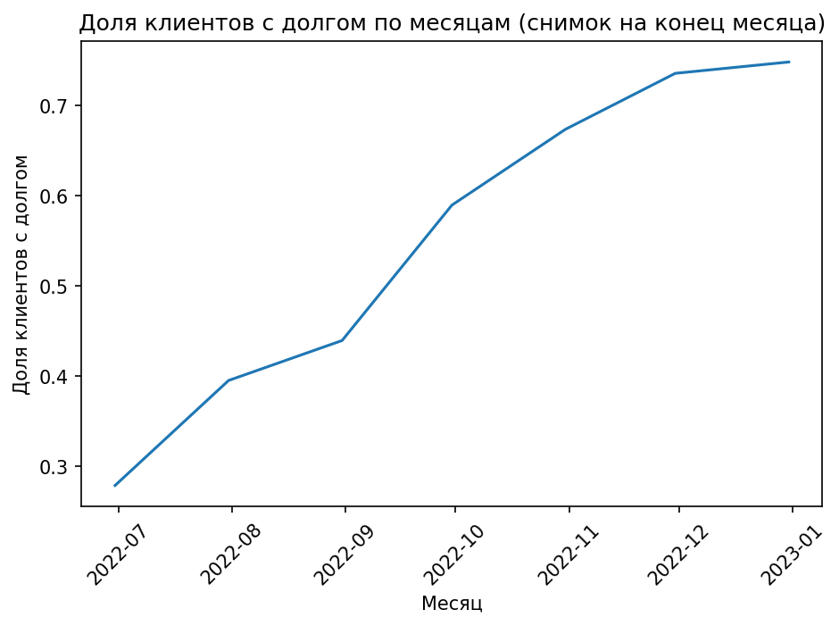
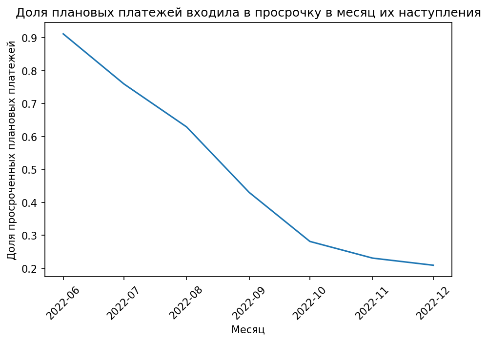

# 📊 Loan Overdue Analysis

Тестовый pet-проект для анализа просрочек по кредитам.  

---

## 🔎 Суть задачи
- Есть данные о кредитах, плановых и фактических платежах (до 08.12.2022).  
- Просрочка = если на дату факт < план.  
- Если клиент догоняет платежами позже → долг обнуляется.  

---

## 📈 Основные результаты
- Доля клиентов с долгом выросла: **27.9% → 74.8%**  
- Пик просрочек по платежам: **91.2% в июне 2022**  
- После **08.12.2022** данные честно обрезаны, чтобы не «накручивать» долг.  

---

## 🖼 Визуализации
Картинки лежат в `src/plots/`  

| Клиенты                           | Платежи                                   |
|-----------------------------------|-------------------------------------------|
|  |  |

---

## ⚙️ Как запустить
### Вариант 1: через Python
```bash
python src/main.py
```
### Вариант 2: интерактивный анализ
```bash
jupyter notebook notebooks/main.ipynb
```

---

## 🛠 Стек

- Python (pandas, matplotlib, seaborn)
- Jupyter Notebook

## 📂 Структура проекта
```bash
project/
│── data/            # входные CSV
│── src/             # код
│   ├── data_loader.py
│   ├── snapshots.py
│   ├── overdue.py
│   ├── visualize.py
│   ├── report.py
│   ├── plots/ 
│── notebooks/
│   └── main.ipynb
│── README.md
│── ТЗ.docx
```
### ✨ Проект задуман как учебный: он показывает подход к обработке данных, внимательность к «грязным» кейсам и умение рассказывать историю цифрами.

